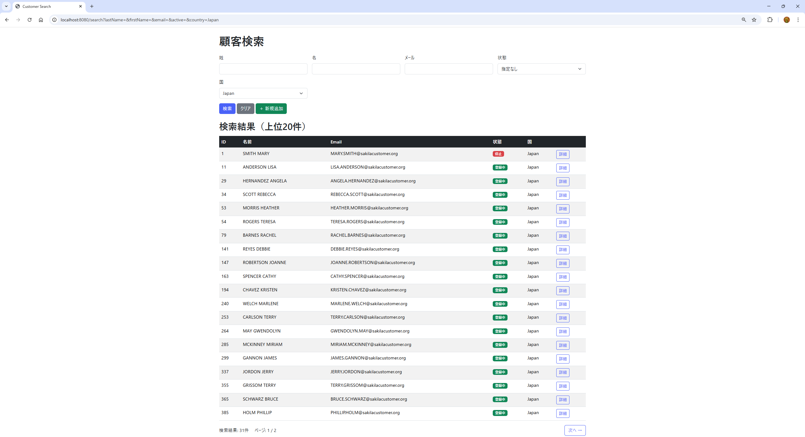
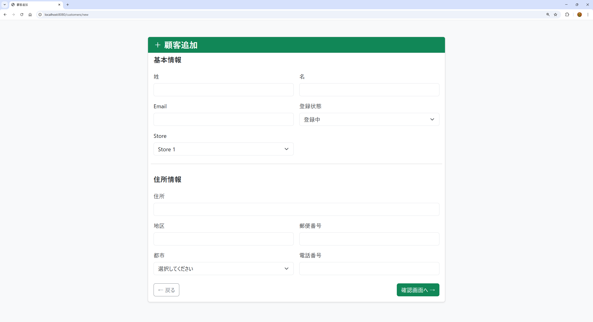
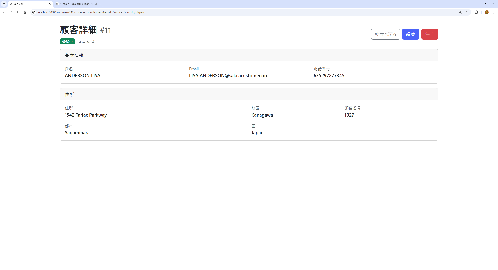

# Spring Boot 顧客管理アプリ

Spring Boot / MyBatis を使用した顧客管理アプリケーションです。
顧客の検索・登録・編集・削除を行う基本的な CRUD 機能を実装しています。

研修で学習した内容をもとに、実践的な Web アプリケーションとして作成しました。

---

# 使用技術

| 技術          | 内容         |
| ----------- | ---------- |
| Java        | 17         |
| Spring Boot | 3.x        |
| MyBatis     | ORM        |
| Thymeleaf   | テンプレートエンジン |
| Bootstrap   | UI         |
| MySQL       | データベース     |
| Docker      | DB環境       |
| Maven       | ビルドツール     |
| JUnit       | テスト        |

---

# 主な機能

* 顧客検索
* 顧客登録
* 顧客編集
* 顧客削除
* ページング機能
* バリデーション
* 削除確認ポップアップ
* Controllerテスト（JUnit）

---

# 画面イメージ

## 顧客検索画面



顧客一覧表示と検索が可能です。
ページング機能を実装しています。

---

## 顧客登録画面



新規顧客を登録できます。
入力値バリデーションを実装しています。

---

## 顧客編集画面



顧客情報を編集できます。

---

# ディレクトリ構成

```
src
 ├─ controller
 ├─ service
 ├─ mapper
 ├─ dto
 ├─ entity
 └─ templates
```

---

# 環境構築

## 前提

以下がインストールされていること

* Java 17
* Maven
* Docker
* Docker Compose

---

# リポジトリ取得

```bash
git clone https://github.com/rekuma-9669/springboot-customer-management.git
cd springboot-customer-management
```

---

# MySQL 起動（Docker）

```bash
docker compose up -d
```

MySQL が起動します。

---

# アプリケーション起動

```bash
mvn spring-boot:run
```

---

# アクセス

```
http://localhost:8080
```

---

# jarファイル作成

```bash
mvn clean package
```

---

# jar起動

```bash
java -jar target/springtest-0.0.1-SNAPSHOT.jar
```

---

# テスト実行

JUnitテストを実行します。

```bash
mvn test
```

---

# DB設定

DockerでMySQLを起動しています。

| 項目       | 値         |
| -------- | --------- |
| host     | localhost |
| port     | 3307      |
| database | sakila    |
| user     | root      |
| password | root      |

---

# 実装ポイント

* Spring Boot を使用した MVC 構成
* MyBatis を使用した DB アクセス
* Thymeleaf + Bootstrap による画面作成
* ページング機能実装
* バリデーション実装
* 削除処理のポップアップ化
* JUnit を使用した Controller テスト

---

# 今後の改善予定

* ログイン機能
* 権限管理
* API化
* テストカバレッジ向上

---

# 作成者

Ryuta
